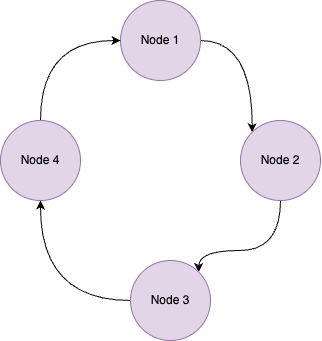

<h1>Day 02 - If you like it, you should put a ring on it!</h1>

_Author:_ <a href="https://x.com/itsmaddox_j" target="_blank">Andrej Jovanović</a>

> TL;DR: Build your very first application with PySyft: aggregate private knowledge from the crowd!

Welcome to this tutorial, where we will create a sample application that performs computation in a ring, hence the name :p. To complete this tutorial, we shall assume that you have successfully completed all the installation steps, and that you are successfully logged on. To confirm whether this is the case, check out this stats page. You should see your email with a bounded green box if you completed all the steps correctly.

Another note: we will make this fairly interactive by showing you all the code snippets and how everything works. Code snippets are going to be shown here:

```python
# This is a sample code block.  
def fib(n):
  a, b = 0, 1
  while a < n:
  print(a, end=' ')
  a, b = b, a+b
  print()
fib(1000)
```
If this was successful, let's begin!


## Step 1: Why do we want to make a ring?
A ring is a typical networking structure that allows various nodes to communicate with one another without access to a central, coordinating server. Instead, the participants in this network coordinate themselves, through receiving and passing on messages in turn. The diagram below should give visualise this.




Why this is important for us in a distributed setting is that it allows us to collaboratively generate knowlegde and share it successfully from person to person. As in, person one could generate a query (i.e start some data aggregation strategy), and they can gather the knowledge of the crowd by passing this message around the ring. Of course, it would be better if this were done in parallel (for speed), but this is still cool nonetheless.


NB: We will return to the scenario of where we use a more graphical message passing structure later. However, our intention is to introduce concepts in small pieces so that we build our knowledge and understanding incrementally.
## Step 2: How does ring work?

We are finally ready to start working with the Ring app. In order to make sure you have this app, you should find it in your local apps directory in your SyftBox folder under the name ring. Inside, you need to see two files:
- `main.py`
- `run.sh`

`main.py` is a Python Scsript that is used to handle all the interaction of the Ring functionality for each local user. We will elaborate on this a bit later. `run.sh` is a shell script that allows SyftBox to run this app periodically, meaning that you can participate in any arbitrary ring!

### Investigating `main.py`

```python
import os
from pathlib import Path
import json
from syftbox.lib import ClientConfig


class RingRunner:
    def __init__(self):
        self.client_config = ClientConfig.load(
            os.path.expanduser("~/.syftbox/client_config.json")
        )
        self.my_email = self.client_config["email"]
        self.my_home = (
            Path(self.client_config["sync_folder"])
            / self.my_email
            / "app_pipelines"
            / "ring"
        )
        self.syft_perm_json = {
            "admin": [self.my_email],
            "read": [self.my_email, "GLOBAL"],
            "write": [self.my_email, "GLOBAL"],
            "filepath": str(self.my_home / "_.syftperm"),
            "terminal": False,
        }
        self.running_folder = self.my_home / "running"
        self.done_folder = self.my_home / "done"
        self.folders = [self.running_folder, self.done_folder]
        self.secret_file = Path(os.path.abspath(__file__)).parent / "secret.txt"

    def setup_folders(self):
        print("Setting up the necessary folders.")
        for folder in self.folders:
            os.makedirs(folder, exist_ok=True)
            with open(folder / "dummy", "w") as f:
                pass
        with open(self.my_home / "_.syftperm", "w") as f:
            json.dump(self.syft_perm_json, f)

    def check_datafile_exists(self):
        files = []
        print(f"Please put your data files in {self.running_folder}.")
        for file in os.listdir(self.running_folder):
            if file.endswith(".json"):
                print("There is a file here.")
                files.append(os.path.join(self.running_folder, file))
        print(f"Found {len(files)} files in {self.running_folder}.")
        return files

    def data_read_and_increment(self, file_name):
        with open(file_name) as f:
            data = json.load(f)

        ring_participants = data["ring"]
        datum = data["data"]
        to_send_idx = data["current_index"] + 1

        if to_send_idx >= len(ring_participants):
            print("END TRANSMISSION.")
            to_send_email = None
        else:
            to_send_email = ring_participants[to_send_idx]

        # Read the secret value from secret.txt
        with open(self.secret_file, 'r') as secret_file:
            secret_value = int(secret_file.read().strip())

        # Increment datum by the secret value instead of 1
        data["data"] = datum + secret_value
        data["current_index"] = to_send_idx
        os.remove(file_name)
        return data, to_send_email

    def data_writer(self, file_name, result):
        with open(file_name, "w") as f:
            json.dump(result, f)

    def send_to_new_person(self, to_send_email, datum):
        output_path = (
            Path(os.path.abspath(__file__)).parent.parent.parent
            / to_send_email
            / "app_pipelines"
            / "ring"
            / "running"
            / "data.json"
        )
        print(f"Writing to {output_path}.")
        self.data_writer(output_path, datum)

    def terminate_ring(self):
        my_ring_runner.data_writer(self.done_folder / "data.json", datum)


if __name__ == "__main__":
    # Start of script. Step 1. Setup any folders that may be necessary.
    my_ring_runner = RingRunner()
    my_ring_runner.setup_folders()
    # Step 2. Check if you have received a data file in your input folder.
    file_names = my_ring_runner.check_datafile_exists()
    # Step 3. If you have found a data file, proceed. Else, nothing.
    if len(file_names) > 0:
        print("Found a data file! Let's go to work.")
        # For this example, this will always be 1. But we can in theory do more complicated logic.
        for file_name in file_names:
            # Step 4. Read the data_file, increment the number and send it to the next person.
            datum, to_send_email = my_ring_runner.data_read_and_increment(file_name)
            # Step 5. If there is another person in the ring, send it to them. Else, terminate.
            if to_send_email:
                my_ring_runner.send_to_new_person(to_send_email, datum)
            else:
                my_ring_runner.terminate_ring()
    else:
        print("No data file found. As you were, soldier.")
```
Let's start by examining the main function call. Our first function call is to instantiate an object of the`RingRunner()` class. This class is responsible for handling all the necessary interactions. When the object is created, (the `__init__` method), we load a whole bunch of properties for your particular `RingRunner`. For example, we fetch your email, we define some folder structures etc.

Once this is done, we then call the `setup_folders()` method, which ensures that you have all the correct folders setup in your app_pipelines directory for the correct functioning of the Ring app. This has all been setup for now. We are ready for the main course!

The first function of the app is to detect whether it has received any data, as governed by the `check_datafile_exists` function. The next set of functionality is broken into two parts:

- If no file is detected, no action happens.
- However, if a file is detected, we proceed to the main functionality of the ring app. The file in question is a simple data.json file that has the following structure as an example:

```json
{
    "ring": [
        "joe@acme.com",
        "susan@gmail.com",
        "bob@gmail.com",
        "joe@acme.com"],
    "data": 5,
    "current_index": 0
}
```
- The "ring" defines the participants in the ring. Notice in this case that it starts and ends with the same individual. 
- This ensures that we follow are circular patters; the person who initiates the message will be the one who receives the final accumulated result.
- Data represents the "accumulated knowledge". Yes, we know it is just an integer :O
- The current index does what it says on the tin: it indicates where in the ring we are located at present.

Once we have received and read the contents of the data, the main function is for each individual to contribute their own data to the ring, a secret if you will. Going ahead with our integer example, what this means is that we want each individual to add their own secret.txt data (a number) to the accumulated data so far. Once this is done, the RingRunner either:

- sends the data packet to the next person in the ring if we have not terminated yet or;
- save the result in the corresponding folder so that we are able to retrieve the final result.

And that is pretty much it. You have seen all the nuts and bolts.
<div style="text-align:center">

</div>

While this may not seem like much, it is the foundation of something quite remarkable. Think about it, we have connected any number of arbitrary participants into a sub-network, and we have profited from the global knowledge we were able to bring together. What is even cooler is that you do not have to be co-located! You can bring people together from all over the globe!

How ever, many of you would notice that there are a lot of things wrong with this...

1. It is not private. At all. Everyone can observe who is involved in the ring, and what the accumulated knowledge is at all times becauase we have been writing in the public domain of SyftBox without any encryption.
2. It is not efficient because the communication is in serial, as discussed before.
3. From an engineering standpoint, it is not the most scalable: we have presupposed that the message, by default, will always be called data.json. What happens if you receive multiple messages? What to do?

If you can think about some solutions for the aforementioned issues, or would like to find out how to solve them, stick around and follow more tutorials here: TODO.