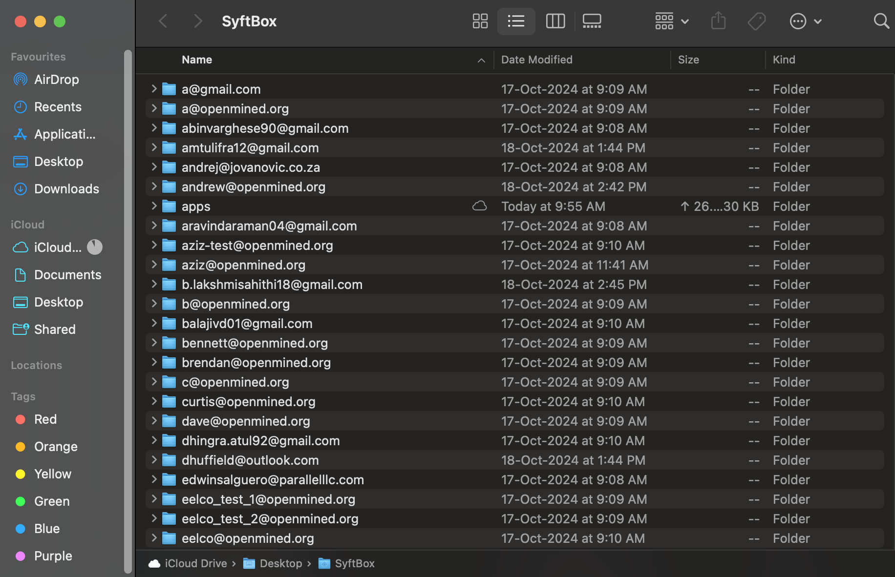

<h1>Day 01 - Intro to Syftbox </h1>
Author: Subha Ramkumar

# What is Syftbox?

Before we dive into building cool programs and apps throughout this 50-day federated learning journey, let’s first get familiar with the platform we’ll be using—Syftbox. Syftbox is a platform designed to build apps and projects that serve groups of individuals by securely accessing and aggregating verified private data. The three most important things Syftbox does are accessing private information securely, aggregating it, and verifying it. Currently under development, Syftbox will be the primary platform for our 50 Days of FL program, providing the foundation for all the awesome projects you’ll build.


# Install Syftbox

Here is the one-line installer for Syftbox on macOS, Linux and WSL on Windows.
```
curl -LsSf https://syftboxstage.openmined.org/install.sh | sh
```
Running this script will both install Syftbox and start your Syftbox client.
Enter your email ID to create your account in Syftbox, aka your datasite!
You should see a folder open up like in the screenshot below, listing a few datasite folders.
You should also be able to see your datasite folder appear in this domain- https://syftbox.openmined.org/datasites




# What is a datasite?


In Syftbox, a datasite refers to your own personal domain. This term is analogous to a website, but here, it’s called a datasite because all the data within belongs to you. You have complete control over which parts of your data are publicly accessible, which are privately accessible, and which pieces you grant selective access to others. Your datasite serves as your fundamental space within Syftbox, allowing you to create, add your data, and develop your own projects. You can also manage permissions to let others access your datasite as needed.


# Part 4: Say Hello to Everyone!

- create an html page and see it on the network

# Part 5: Explore other datasites! (and maybe look for data)

- (link to aziz's datasite browser)
- (link to some other interesting/popular/interactive pages)

# Congratulations!!

- tomorrow you'll build your first federated app

# Bonus: customize your page!

You've successfully installed and run SyftBox. You're now ready to explore the broad listening internet. Follow along here to `Day 01` of the `50-DAYS-OF-FL-CODE`.
<style>
/* Enable smooth scrolling */
@media screen and (prefers-reduced-motion: no-preference) {
  html {
    scroll-behavior: smooth;
  }
}
