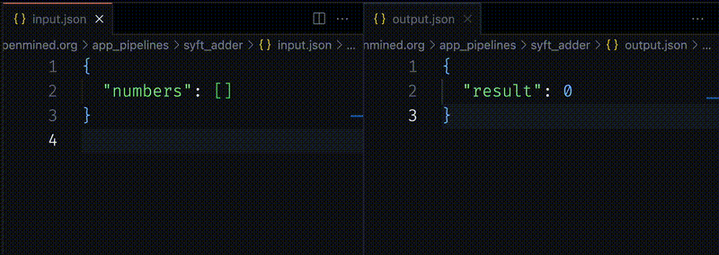

<h1>Day 02 - Write your own Syft app</h1>

Author: Matei Simtinică

## What is a Syft app?

Simply put, a Syft app is defined by a script that runs at a specified interval. It runs locally, on the computers of each client that has it installed and can be used to execute operations across multiple clients.

You can write your own apps, or install apps from a GitHub repository.

## Install a Syft app

To install a Syft app, you can use the Syftbox CLI:

```shell
syftbox app install APP_NAME
```

`APP_NAME` is the slug of a repo containing a Syft app. For example, to install the Ring app, run:

```shell
syftbox app install OpenMined/ring
```

**Note**: Ring is an app designed to execute operations in a simple distributed paradigm and will be covered in detail starting with Day 03.

That's it! Syft will now deal with running your app and syncing necessary files across other clients that are also using it.

## Syft apps structure

The most important part of a Syft app is its entrypoint: `run.sh`.
`run.sh` is automatically recoginzed by Syft and runs by default every 10 seconds. You can configure an app to run at different intervals, but this is outside the scope of this guide.

A simple `run.sh` script can look like this:

```shell
#!/usr/bin/env bash

echo "Running my app..."
```

This app will print a message every 10 seconds (which you could see in the logs).

### Other files

Syft only cares about your entrypoint, `run.sh`, but you can make use of any other files (configurations, dependencies, helper scripts) to define all sorts of behaviors for your apps.

## Write a simple Syft app: `syft_adder`

Let's write a simple Syft app (in Python) that adds the numbers written in a JSON file and outputs the result in a different file. We'll call it `syft_adder`.

The app will look at a file called `input.json`, structured like this:

```json
{
  "numbers": [1, 2, 3]
}
```

It will compute the sum of those numbers and ouput the result to a file called `output.json`, structured like this:

```json
{
  "result": 6
}
```

Pretty simple, right? The purpose of this app is to illustrate the basic mechanisms of Syft apps and how you can expand on them to define more complex behaviors.

### Step 1: Define neccessary files

Syft allows you to define any file structure that suits your apps.
We recommend the following conventions:

- make sure
- use `app_pipelines` as the directory for managing files handled by your app
- use your app's name as a namespace inside `app_pipelines`

`syft_adder` will need an _input_ file and an _output_ file. We'll use the current client's directory to store the data, so the `Client` object will be useful to manage the filepaths:

```py
from pathlib import Path
from syftbox.lib import Client

client_config = Client.load()

app_dir = (
    Path(client_config.sync_folder)
    / client_config.email
    / "app_pipelines"
    / "syft_adder"
)

input_filepath = app_dir / "input.json"
output_filepath = app_dir / "output.json"
```

### Step 2: Initialize the app directory and files

Our app's code will run every 10 seconds, but on the inital run (and in the case we delete the app's files for any reason) it needs to initialize the file structure. We'll add some logic that deals with these situations:

```py
import os
import json

os.makedirs(app_dir, exist_ok=True)

if not os.path.exists(input_filepath):
    with open(input_filepath, "w") as f:
        json.dump({"numbers": []}, f, indent=2)
    print(f"Initialized input file at {input_filepath}.")
```

### Step 3: Main app logic

Now our app should be able to deal with an uninitialized file structure. This will be the case right after the app is installed or when you delete the files

Let's add the main computation logic, which will read the numbers from `input.json` and output the result to `output.json`:

```py
with open(input_filepath) as f:
    data = json.load(f)

numbers = data["numbers"]
result = sum(numbers)

with open(output_filepath, "w") as f:
    json.dump({"result": result}, f, indent=2)
```

The final app code should look something like this:

```py
import os
import json
from pathlib import Path
from syftbox.lib import Client

# Load Syft client configuration
# ======================
client_config = Client.load()

# Define the app directory and file paths
# ==============================
app_dir = (
    Path(client_config.sync_folder)
    / client_config.email
    / "app_pipelines"
    / "syft_adder"
)

input_filepath = app_dir / "input.json"
output_filepath = app_dir / "output.json"

# Initialize the app directory
# ======================
os.makedirs(app_dir, exist_ok=True)

# Initialize the input file if it doesn't exist
# ==============================
if not os.path.exists(input_filepath):
    with open(input_filepath, "w") as f:
        json.dump({"numbers": []}, f, indent=2)
    print(f"Initialized input file at {input_filepath}.")

# Main app logic: read input, process data, and write output
# ==============================

# Read the numbers from the input file
with open(input_filepath) as f:
    data = json.load(f)

# Compute the sum of the numbers
numbers = data["numbers"]
result = sum(numbers)

# Write the result to the output file
with open(output_filepath, "w") as f:
    json.dump({"result": result}, f, indent=2)
```

### Step 4 (final): Make the app run on Syft

Our `syft_adder` app logic is complete. Now we need to write the final script to a file and make sure Syft will know how to run it.

First, we need to define a directory for `syft_adder` in our client's `apps` directory. You should be able to find it in your _Syft installation directory_, at `sync/apps`.

1. Create a new directory, `syft_adder`, under `sync/apps`
2. Create a `main.py` file with the app code inside the `syft_adder` directory.
3. Create a `run.sh` file with the command for running our app's code inside the `syft_adder` directory:

```sh
#!/usr/bin/env bash

python main.py
```

That's pretty much it! You should now see a new directory created inside `sync/YOUR_EMAIL`, called `syft_adder`, containing 2 files:

- `input.json`:

```json
{
  "numbers": []
}
```

- `output.json`

```json
{
  "result": 0
}
```

If you add numbers in the `numbers` list in the `input.json` file, you should be able to see Syft run your app and have the results appear in `output.json`


