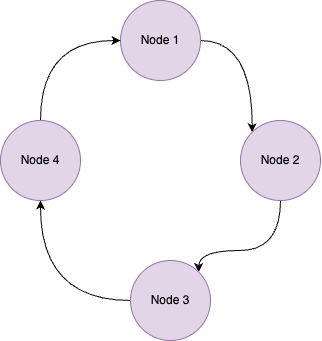

<h1>Day 03 - If you like it, you should put a ring on it!</h1>

_Author:_ <a href="https://x.com/itsmaddox_j" target="_blank">Andrej Jovanović</a>

> TL;DR: Build your very first application with PySyft: aggregate private knowledge from the crowd!

Welcome to this tutorial, where we will _finally_ create the Ring app, hence the name :p (might have had a bit too much fun with that one)!. In _yesterday's_ tutorial, we introduced you to the concept of what the Ring app is through demonstration only. However, today, you will actually create the Ring app for yourself so that you can see the inner workings. What this exercise will also do is it will setup the general framework of applications going forward. What we mean by this is: the Ring app we will build today is _intentionally simplified_ in certain aspects. However, this let's us introduce concepts in addition to Ring (for example: federated learning with the Ring, Differential Privacy with the Ring) once we have a solid foundation.

To complete this tutorial, we shall assume that you have successfully completed all the installation steps, and that you are successfully logged on. To confirm whether this is the case, check out this stats page. You should see your email with a bounded green box if you completed all the steps correctly. Additionally, we shall assume that you completed the remainder of Day 01 and Day 02; this is just so that you are familiar with the general structure of SyftBox. If you haven't done so, please go checkout those tutorials before starting with today's.

Another note: we will make this fairly interactive by showing you all the code snippets and how everything works. Code snippets are going to be shown as below:

```python
# This is a sample code block.  
def fib(n):
  a, b = 0, 1
  while a < n:
  print(a, end=' ')
  a, b = b, a+b
  print()
fib(1000)
```
If this was successful, let's get ready to rock and roll!

> As always, should you need support, please [file an issue here](https://github.com/OpenMined/50DaysOfFLCode), or join the OpenMined [slack channel](https://communityinviter.com/apps/openmined/openmined/) to post a question that the team can help answer!
## Step 1: Why do we want to make a ring?
A ring is a typical networking structure that allows various nodes to communicate with one another without access to a central, coordinating server. Instead, the participants in this network coordinate themselves, through receiving and passing on messages in turn with their immediate neighbours so to speak. The diagram below should give visualise this.




Why this is important for us in a distributed setting is that it allows us to collaboratively generate knowledge and share it from person to person _without a central governing body facilitating this request_. As in, person one could generate a query (i.e ask a question: "What is everyone watching on Netflix today?"), and they can gather the knowledge from crowd by passing this message around the ring. What you would get back is everyone's current Netflix watching data so you get a statistic that is accurate in realtime. Of course, it would be better if this were done in parallel (for speed) and if we had some privacy guarantees attached, but this is still cool nonetheless.

_Hint: maybe, just maybe, we will be doing this in the future.... Hmm....._
## Step 2: How does ring work?

We are finally ready to start building the Ring app up step by step. We have  [a full reference implementation](https://github.com/OpenMined/ring) linked here. If you want to jump ahead and view the code that is already done, go ahead. However we think it will be beneficial for you to follow along step by step to build the full picture.

Okay, so what does our Ring app do? Essentially, we can break it down into the following functions:
1. We  need to be able to continuously monitor a certain directory to see whether we have received a new Ring file to process. If we find the files, we should return the locations of those files so that we can open it.
2. We need to be able to perform some computation on every file that we receive in the Ring app. (This has been worded vaguely intentionally. Computation can really be anything; in our case, we will be adding numbers as you saw in the first example).
3. We need to be able to write the results of our computation to an output location.
4. We need to send the data file over to the next person in the ring, or terminate if we were the final person.

### Step 2.1: Writing the 'run' function. 
In this first step, we want to create the main function of our ring app. Let's call it `run()`. This function will be used to encapsulate all of the above four functions into a single concise method. We will also be using two more functions: i) `pending_input_files` and `process_input`. The first function will be used to search to through a directory looking for potential files to process. The latter will perform steps 2-4 above: namely preforming computation and then looking what to do with the data next. 
<details>
<summary><b>Click here to see the completed function!</b></summary>

```python
def run(self) -> None:
    self.setup_folders()
    input_files = self.pending_inputs_files()
    for file_name in input_files:
        self.process_input(file_name)

    if len(input_files) == 0:
        print("No data file found. As you were, soldier.")
```
NB: We also have a function called `setup_folders` that we haven't spoken about. All this does is that it ensures all of the files for our app are defined so that we don't run into any troubles. You can add it later; don't worry about it too much for now.

NBx2: For those with more programming experience: you may notice that we have a dangling reference to `self`. This is because are creating a single `RingRunner` class following the bestest of all coding practices :D. _Don't judge, plz_
</details>

### Step 2.2: How to we get input files?
Great! We have constructed the main functional body of our system. However, we have just used some functions that we know perform some purpose, but we haven't really dug into them. Let's start with `pending_input_files`

This function is pretty simple. Let's say that we have access to a folder that we call `running_folder`. This is the folder that we have defined for all Ring job requests, if you will, to arrive. What we want our function to do is to scan through this folder, and return the paths of any `json` files found inside, if any. Again, we use `json` files as convention here as we wanted to specify a specific format type for the data that we will receive.
<details>
<summary><b>Click here to see the completed function!</b></summary>

```python
 def pending_inputs_files(self) -> List[Path]:
        return [self.running_folder / file for file in self.running_folder.glob("*.json")]
```
</details>

### Step 2.3: Okay, we have found some files. Now we need to process them, right?
Yes, yes. We are going to process the files!!!


As mentioned above, we call this function `process_input`, and from the code that was written above, it will only be called if we encounter a `json` file in our `running` folder. Okay, but what is the data we are working with? We assume all our files that are being used in the ring are written in the following way:
```json
{
    "ring": [
        "joe@acme.com",
        "susan@gmail.com",
        "bob@gmail.com",
        "joe@acme.com"],
    "data": 5,
    "current_index": 0
}
```
There are three components: 
1. The ring itself: this defines the participants of the ring. Notice that we have a convention here where the first and last entries in the ring are the same email: this is to ensure that the person who kicks off the ring will be the person who receives it at the end. We don't want our information to get lost at the end of the day!
2. The data: this is the "accumulated knowledge" from the crowd. For this example, we are just incrementing an integer. But this could be any knowledge: time to be creative in the future .
3. The current index: this is a number that simply tells us where in the ring we currently are; it tells us who we are sending the information to next.

Okay, now we have finally seen how the information that we are passing around looks like. How we can breakdown the process_input function into three more steps:

1. First, we need to read in the json file from a particular path. The function for this will be called `load_json`.
2. Next, we will add our own secret to the ring: this value is obtained from the function `my_secret`. 
3. Once we have added the secret to the ring data, we have to get ready to send it to the next person. Now two things can happen here:
    1. If we have reached the end of the ring (hint: use the index), we should make a call to `terminate` the ring.
    2. If there are still people to send to, we should find who they are and then send the data with `send_data`.

Take a try to code this all by yourself!

<details>
<summary><b>Click here to see the completed function!</b></summary>

```python
def process_input(self, file_path) -> None:
    print(f"Found input {file_path}! Let's get to work.")

    ring_data = RingData.load_json(file_path)

    ring_data.data += self.my_secret()
    next_index = ring_data.current_index + 1

    if next_index < ring_data.ring_length:
        next_person = ring_data.ring[next_index]
        ring_data.current_index = next_index
        self.send_data(next_person, ring_data)
    else:
        self.terminate_ring(ring_data)
```
</details>

### Step 2.4 The final helpers!

Okay, I promise that we are almost there. All we need to do is to finish up the helper functions `load_json`, `my_secret(), `send_data` and `terminate_ring`. Let's go one by one.

#### `load_json`
This does what it says on the tin: given a path to a `json` file, we load it's data!
<details>
<summary><b>Click here to see the completed function!</b></summary>

```python
@classmethod
def load_json(cls, file):
    with open(file, "r") as f:
        return cls(**from_json(f.read()))
```
</details>

#### `my_secret`
This function loads our secret message! For this example, we assume that we have defined where our secret is located in `secret_file`, which is itself a `.txt` containing an integer. We want to load this number and store it so that we can add it to the ring data when our time comes.

Remember: the secret should be secret: it should be in a place that only you can see!

<details>
<summary><b>Click here to see the completed function!</b></summary>

```python
def my_secret(self):
    with open(self.secret_file, "r") as secret_file:
        return int(secret_file.read().strip())
```
</details>

#### `send_data`
In order to send some data, we need to know a few things:
1. We need to know to whom to send it to. The ring data file tells us this by giving us the email of the next person in the ring.
2. We need to be able to write the `json` file with our added secret to the new persons datasite. By convention, we will assume that the person's running folder, much like ours, is found in the following structure `{email}/app_pipelines/ring/running/`


Make a function to send the new data over!
<details>
<summary><b>Click here to see the completed function!</b></summary>

```python
def send_data(self, email: str, data: RingData) -> None:
    destination_datasite_path = Path(self.client.sync_folder) / email
    dest = destination_datasite_path / "app_pipelines" / "ring" / "running" / "data.json"
    self.write_json(dest, data)
```
</details>


#### `terminate_ring`
Okay, so we have reached the end of the ring. Now we need to terminate it. In order to do so, all we do is instead of transfering the data to another person, we transfer it to ourselves into our own folder called `done_folder`. This the final function! You can do it!

<details>
<summary><b>Click here to see the completed function!</b></summary>

```python
def terminate_ring(self, data: RingData) -> None:
    print(f"Terminating ring, writing back to {self.done_folder}")
    self.write_json(self.done_folder / "data.json", data)

```
</details>

## Step 3: Woohoo! We are done! Time to package it!

Well done! You have successfully coded up the Ring App. In the below toggle, we will show you our implementation in full. There is also some extra stuff that we have added there. Essentially it is all extra configuration to make sure everything is running as it should with SyftBox.

<details>
<summary><b>👨‍💻 Click here to see the full code.</b></summary>
### Investigating `main.py`

```python
import os
from pathlib import Path
from typing import List
from syftbox.lib import Client, SyftPermission
from pydantic import BaseModel
from pydantic_core import from_json


RING_APP_PATH = Path(os.path.abspath(__file__)).parent


class RingData(BaseModel):
    ring: list[str]
    data: int
    current_index: int

    @property
    def ring_length(self) -> int:
        return len(self.ring)

    @classmethod
    def load_json(cls, file):
        with open(file, "r") as f:
            return cls(**from_json(f.read()))

class RingRunner:
    def __init__(self):
        self.client = Client.load()

        self.my_email: str = self.client.email
        
        # this is where all the app state goes
        self.ring_pipeline_path: Path = Path(self.client.datasite_path) / "app_pipelines" / "ring"
        # this is where the pending inputs go
        self.running_folder: Path = self.ring_pipeline_path / "running"
        # this is where the final result goes of a completed ring
        self.done_folder: Path = self.ring_pipeline_path / "done"
        # this is your personal secret
        self.secret_file: Path = RING_APP_PATH / "secret.txt"

    def run(self) -> None:
        self.setup_folders()
        input_files = self.pending_inputs_files()
        for file_name in input_files:
            self.process_input(file_name)

        if len(input_files) == 0:
            print("No data file found. As you were, soldier.")
        
    def process_input(self, file_path) -> None:
        print(f"Found input {file_path}! Let's get to work.")

        ring_data = RingData.load_json(file_path)

        ring_data.data += self.my_secret()
        next_index = ring_data.current_index + 1

        if next_index < ring_data.ring_length:
            next_person = ring_data.ring[next_index]
            ring_data.current_index = next_index
            self.send_data(next_person, ring_data)
        else:
            self.terminate_ring(ring_data)

        self.cleanup(file_path)

    def cleanup(self, file_path: Path) -> None:
        file_path.unlink()
        print(f"Done processing {file_path}, removed from pending inputs")

    def setup_folders(self) -> None:
        print("Setting up the necessary folders.")
        for folder in [self.running_folder, self.done_folder]:
            folder.mkdir(parents=True, exist_ok=True)

        # after this there will be files (so we can sync)
        permission = SyftPermission.mine_with_public_write(self.my_email)
        permission.ensure(self.ring_pipeline_path)  

    def my_secret(self):
        with open(self.secret_file, "r") as secret_file:
            return int(secret_file.read().strip())

    def pending_inputs_files(self) -> List[Path]:
        return [self.running_folder / file for file in self.running_folder.glob("*.json")]

    def write_json(self, file_path: Path, result: RingData) -> None:
        print(f"Writing to {file_path}.")
        file_path.parent.mkdir(parents=True, exist_ok=True)
        with open(file_path, "w") as f:
            f.write(result.model_dump_json())

    def send_data(self, email: str, data: RingData) -> None:
        destination_datasite_path = Path(self.client.sync_folder) / email
        dest = destination_datasite_path / "app_pipelines" / "ring" / "running" / "data.json"
        self.write_json(dest, data)

    def terminate_ring(self, data: RingData) -> None:
        print(f"Terminating ring, writing back to {self.done_folder}")
        self.write_json(self.done_folder / "data.json", data)

### Have a main function so that we can call our runner.
if __name__ == "__main__":
    runner = RingRunner()
    runner.run()
```
</details>
We assume that all of our code is doing to be written in a `main.py` file. As with our adder app in the previous tutorial, we need to write some sort of `bash` script that can call our ring app.

The bash script called `run.sh` is written like this:
```bash
#!/bin/sh

# this will create venv from python version defined in .python-version
uv venv

# install requirements for the project
uv pip install -r requirements.txt

# run app using python from venv
uv run main.py
```

As with all other apps, all of our materials should this should be placed in the apps folder in its own folder called `ring`.

And that is pretty much it. You have seen all the nuts and bolts. And now you are ready to rock and roll.
<div style="text-align:center">

</div>

While this may not seem like much, it is the foundation of something quite remarkable. Think about it, we have connected any number of arbitrary participants into a sub-network, and we have profited from the global knowledge we were able to bring together. What is even cooler is that you do not have to be co-located! You can bring people together from all over the globe!

However, many of you would notice that there are a lot of things wrong with this...

1. It is not private. At all. Everyone can observe who is involved in the ring, and what the accumulated knowledge is at all times because we have been writing in the public domain of SyftBox without any encryption.
2. It is not efficient because the communication is in serial, as discussed before.
3. From an engineering standpoint, it is not the most scalable: we have presupposed that the message, by default, will always be called data.json. What happens if you receive multiple messages? What to do?

If you can think about some solutions for the aforementioned issues, or would like to find out how to solve them, stick around and follow more tutorials here.

## BONUS
For those of you that have been following along very closely, we see that we have defined our `RingRunner` in a very specific way as a class. Also, what was the computation that this specific app performed? Essentially, all of the apps functionality can be boiled down to this line:
```python
ring_data.data += self.my_secret()
```
We read our secret, and added it to the accumulated data. But what happens if we were a bit more general. Instead of reading a secret, what happens if we had:
```python
ring_data.data = ring_function(ring_data, self.secret_file)
```
a ring function? This essentially means that we are open to any computation, as I alluded to before. Think about some interesting applications of your own for this ring setup! We would be very down to see what you come up with; when you make something cool, [make a PR here!](https://github.com/OpenMined/50DaysOfFLCode)

Thanks for sticking around, and good luck with rest of the days!!!