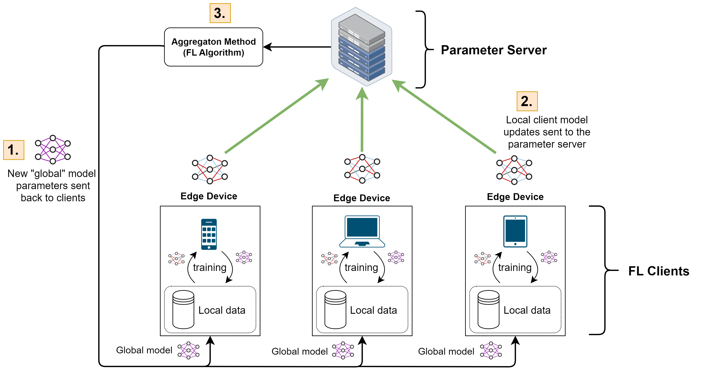

# Day 05 - Learning Ring: Running Federated Learning in a Distributed Ring.

_Author_: Ionesio Junior, <a href="https://x.com/itsmaddox_j" target="_blank">Andrej Jovanović</a>

```
Learn how to transform your ring application to support federated learning, allowing distributed nodes to collaboratively train machine learning models without sharing raw data.
```

Welcome back! In the last tutorial, we transformed our ring application into a generic framework capable of running arbitrary functions across distributed nodes. This flexibility was the foundation for adding privacy-preserving techniques like differential privacy.

In this tutorial, we'll take a step further into the world of privacy-preserving machine learning by introducing the **federated learning (FL)** ring app. Instead of focusing on privacy at the data aggregation level, federated learning enables nodes to collaboratively train a shared model without sharing their local datasets. This way, each node improves the model based on its local data, keeping sensitive information private by never aggregating all of the data at one location.

----------

## Table of Contents

-   [Step 1: Introduction to Federated Learning](#step-1-introduction-to-federated-learning)
-   [Step 2:  Using our previous generic ring app](#step-2-using-our-previous-generic-ring-app)
-   [Step 3: Implementing Federated Model Training](#step-3-implementing-federated-model-training)
-   [Conclusion](#conclusion)

----------

## Step 1: Introduction to Federated Learning

For those of you who are not familiar with federated learning, we provide a brief introduction into the framework below. If you are interesting in learning more, please [please visit this resource](https://github.com/deep-learning-indaba/indaba-pracs-2024/blob/main/practicals/Federated_Learning/Federated_Learning.ipynb) to see a whole tutorial dedicated to understanding the in's and out's.


Generally speaking, federated learning is a decentralized approach to training machine learning models across multiple nodes. Instead of aggregating all of the training data on a single node, federated learning pushes computation to the edge wich that each device conducts local training on its own local data. Instead of the data, federated learning clients communicate information that is captured in the model itself which allows all federated clients to learn a global model collaboratively. The whole setup can be summarised in a three step process, as seen in the image below:


[1]: Image taken from https://github.com/deep-learning-indaba/indaba-pracs-2024/blob/main/practicals/Federated_Learning/Federated_Learning.ipynb


> Federated learning operates in successive global rounds of training. Each global round is coprised of a three step process.
>
> 1. First, the parameter server sends a copy of the global model to each client.
> 2. The clients then commence with local training on their local data with their copy of the model for a number of local epochs. Once this training is completed, clients communicate the updates and and the model updates to the server.
> 3. We then rely on a central parameter server that is responsible for aggregating all the updated client models into a single global update which forms the global model for the next round.

While we do not have an explicit parameter server in our scenario, we can perform a running federated update in this scenario. Specifically, we can have a continuously update the model with new parameter information as this data is passed from client to client in the ring. Of course, we can also extend this to pre-allocate a trusted aggregation server instead of using a Ring. Mathematically, this would be equivalent. 

This approach offers several benefits:

1.  **Data Privacy:** Since raw data never leaves the local node, sensitive information remains private.
2.  **Efficiency:** Nodes can process data locally, reducing the amount of data transferred across the network.
3.  **Scalability:** Multiple nodes can participate in the learning process without bottlenecking a central server.

We'll modify our ring application to implement federated learning. Each node will train a model using its local dataset, then pass the updated model to the next node in the ring. At the end of the process, we’ll have a fully trained model that incorporates knowledge from all participating nodes.

## Step 2: Using our previous generic ring app

Since our ring app is already designed to execute a generic `ring_function` task, no modifications are required in the `main.py` file. This structure inherently supports our federated learning use case.

## Step 3: Implementing Federated Model Training

For federated learning, we’ll need to modify the `ring_function` to handle model training and updates. Each node will load the model, train it on its local dataset, and pass the updated model to the next node.

### Example structure of the new secret.json

In federated learning, the secret file (`secret.txt`) contains the path to the dataset that will be used during the training process. The structure will look like this:

```
/path/to/dataset
```

Each node will have its own secret.txt file containing the path to its local dataset. This file and the dataset should be kept private to ensure the data's security.

### Example structure of the new data.json

The `data.json` file, which is exchanged between nodes, will be updated to include machine learning configurations such as `learning_rate`, `number_of_iterations`, and other relevant parameters.
```
{
   "ring": ["a@openmined.org", "b@openmined.org", "a@openmined.org"],
   "data": 0,
   "current_index": 0,
   "iterations": 1000,
   "learning_rate": 0.1,
   "model": "mnist_model.pth"
}
```

The `model` field stores the path to the shared machine learning model. Each node will load this model, train it on its local data, and then pass the updated model to the next node.

### Example structure of the new ring_function

The `ring_function` will load the model, train it using the local dataset, and return the updated model to the ring:
```python
from pathlib import Path
from types import SimpleNamespace
import torch
import torch.nn as nn
import torch.optim as optim
from torch.utils.data import DataLoader
from torchvision import datasets, transforms
from syftbox.lib import Client, SyftPermission
from torch.utils.data import DataLoader, TensorDataset
import shutil
import os

# Define a simple neural network with two fully connected layers
class SimpleNN(nn.Module):
    def __init__(self):
        super(SimpleNN, self).__init__()
        self.fc1 = nn.Linear(28 * 28, 128)  # First fully connected layer (input: 28x28, output: 128)
        self.fc2 = nn.Linear(128, 10)  # Second fully connected layer (input: 128, output: 10)

    def forward(self, x):
        x = x.view(-1, 28 * 28)  # Flatten the input tensor to match the input size of the first layer
        x = torch.relu(self.fc1(x))  # Apply ReLU activation function to the output of the first layer
        x = self.fc2(x)  # Pass through the second layer to get the final output
        return x

# Define the ring function for federated learning in a ring topology
def ring_function(ring_data: SimpleNamespace, secret_path: Path):
    client = Client.load()  # Load client instance to interact with Syft permissions and data management
    dataset_path = ""  # Initialize the dataset path variable

    # Read dataset path from the provided secret file
    with open(secret_path, "r") as secret_file:
        dataset_path = secret_file.read().strip()  # Read and strip any extra whitespace from the dataset path

    # Check if the current participant is the last in the ring
    if ring_data.current_index >= len(ring_data.ring) - 1:
        # Define the path to move the model to indicate the training process is complete
        done_pipeline_path: Path = (
            Path(client.datasite_path) / "app_pipelines" / "fl_ring" / "done"
        )
        destination_datasite_path = Path(client.sync_folder) / client.email  # Define the user's sync folder path
        new_model_path = (
            destination_datasite_path
            / "app_pipelines"
            / "fl_ring"
            / "running"
            / ring_data.model
        )

        # Move the model to the 'done' directory to indicate the end of training
        shutil.move(new_model_path, str(done_pipeline_path))
        return 0  # Exit the function since the training is complete
    
    model = SimpleNN()  # Initialize the model

    # Load serialized model if present
    if hasattr(ring_data, "model"):
        state_dict = torch.load(ring_data.model)  # Load the model state from the provided file
        model.load_state_dict(state_dict)  # Update the model with the loaded state

    # Define the loss function (cross-entropy loss) for classification tasks
    criterion = nn.CrossEntropyLoss()
    # Define the optimizer (Stochastic Gradient Descent) with a learning rate from ring_data
    optimizer = optim.SGD(model.parameters(), lr=float(ring_data.learning_rate))

    # Get list of dataset files in the dataset path (only files with '.pt' extension)
    dataset_path_files = [f for f in os.listdir(dataset_path) if f.endswith('.pt')]
    
    # Iterate over each dataset file
    for dataset_file in dataset_path_files:

        # Load MNIST dataset subset
        transform = transforms.Compose([transforms.ToTensor()])  # Define transformation to convert images to tensors
        images, labels = torch.load(dataset_path + '/' + dataset_file)  # Load the saved MNIST subset (images and labels)

        # Create a TensorDataset from the loaded images and labels
        dataset = TensorDataset(images, labels)

        # Create a DataLoader to iterate over the dataset in batches for training
        train_loader = DataLoader(dataset, batch_size=32, shuffle=True)

        print("\n\n Training...\n\n ")
        # Training loop
        for epoch in range(int(ring_data.iterations)):
            for i, (images, labels) in enumerate(train_loader, 1):
                optimizer.zero_grad()  # Clear gradients from the previous step
                outputs = model(images)  # Forward pass through the model to get predictions
                loss = criterion(outputs, labels)  # Calculate the loss between predictions and actual labels
                loss.backward()  # Backward pass to calculate gradients
                optimizer.step()  # Update model parameters using calculated gradients

    print("\n\n Done...\n\n ")

    # Evaluate the model on the training data to check its performance
    correct = 0  # Initialize count of correct predictions
    total = 0  # Initialize total count of predictions
    with torch.no_grad():  # Disable gradient calculations during evaluation
        for images, labels in train_loader:
            outputs = model(images)  # Get model predictions
            _, predicted = torch.max(outputs.data, 1)  # Get the class with the highest score
            total += labels.size(0)  # Increment total count by the batch size
            correct += (predicted == labels).sum().item()  # Increment correct count if predictions match labels

    # Calculate accuracy as the percentage of correct predictions
    accuracy = 100 * correct / total
    print(f'Accuracy of the model on the test dataset: {accuracy:.2f}%')

    # Update the ring index to the next participant for the next round of federated learning
    next_index = ring_data.current_index + 1
    next_person = ring_data.ring[next_index]  # Get the next participant in the ring

    # Define the path to save the updated model for the next participant
    destination_datasite_path = Path(client.sync_folder) / next_person
    new_model_path = (
        destination_datasite_path
        / "app_pipelines"
        / "fl_ring"
        / "running"
        / ring_data.model
    )

    print(f"\n\n Saving it in {str(new_model_path)}\n\n")
    # Serialize and save the updated model to the specified path
    os.makedirs(os.path.dirname(str(new_model_path)), exist_ok=True)  # Create directories if they do not exist
    torch.save(model.state_dict(), str(new_model_path))  # Save the model state dictionary
    return 0  # Return 0 to indicate successful completion
```

## Conclusion

In this tutorial, we extended our ring application to support federated learning. This distributed approach to machine learning allows nodes to collaboratively train a model without sharing their raw data, ensuring data privacy while leveraging the computational power of multiple nodes.

By modifying `ring_function` to accommodate federated learning, we’ve taken a major step toward creating a flexible and privacy-preserving distributed framework. This new functionality enables each node to contribute to a shared model, making it suitable for real-world applications where data privacy is critical.

The federated learning example also opens up opportunities for further enhancements:

-   **Model Aggregation:** In future tutorials, we’ll explore how to implement model aggregation techniques like Federated Averaging (FedAvg) to combine model updates from multiple nodes effectively.
-   **Privacy and Security:** We’ll also look at ways to improve the security of federated learning by integrating secure aggregation or homomorphic encryption to prevent malicious nodes from learning about others’ data.
-   **Scalability:** As we expand our ring to include more nodes, we’ll need to ensure that the system remains scalable and efficient, minimizing communication overhead and processing time.

Stay tuned for the next tutorial, where we’ll continue to build on this foundation by exploring advanced aggregation techniques and improving the robustness of our ring. Happy coding!
